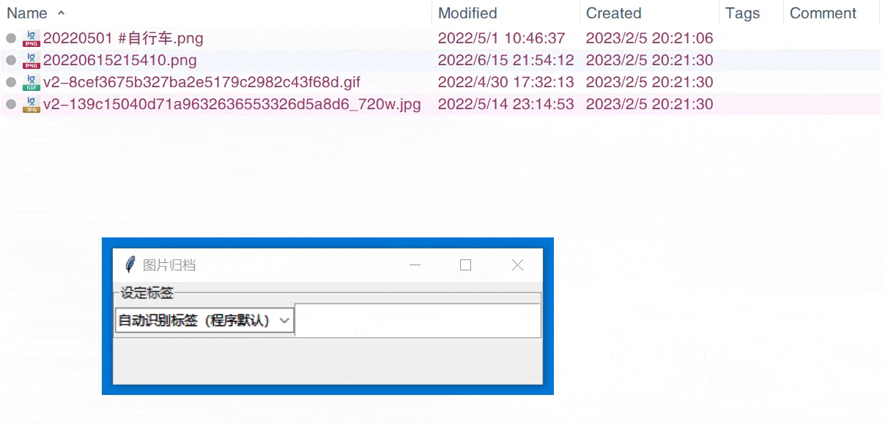
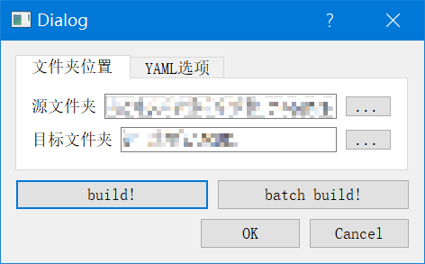

# toolbox

gathering my functions together

图片处理：[项目笔记](https://www.notion.so/mightymjolnir/22c4306ed4c34a7b8ff4951718344002)

**复制图片元信息**：主要是图片批处理过后复制源文件的创建时间和修改时间，运行 `copy_pic_metadata.py`
**图片文件整理（重命名）**：
运行 `rename.py`，拖动图片文件 | 包含图片的文件夹到 GUI 窗口。

- 文件关键信息的修改历史保存在 `images_change.log`，如果出现误处理可以追溯原始信息。
- 如果出现名称冲突，命名结果出现 uuid，可以尝试重新命名
- 担心误操作可以先用压缩文件备份（但是创建时间还是会丢失）

**文档文件转换成 html**：
运行 `window.py`，设置源文件夹和目标文件夹，点击 build 按钮进行转换。

1. build: 源文件夹当作文档文件夹，在目标文件夹创建同名文件夹存放 html
2. batch build: 源文件夹里有多个文档文件夹，在目标文件夹分别创建同名文件夹存放 html
3. checkbox 设定是否要添加 navigation.tab 特性

> 不准备进一步更新这个功能了，因为太复杂的需求直接手动自定义 mkdocs.yaml 文件即可。

**扫描并保存文件夹下的文件结构**
`python FileKit/scan_dir.py --folder <folder to be scanned> --output <output folder>`

- 隐藏文件也能够被扫描到，但是在扫描结果中不会区分
- 默认不会进入符号链接
- 需要模块 `json2tree`
